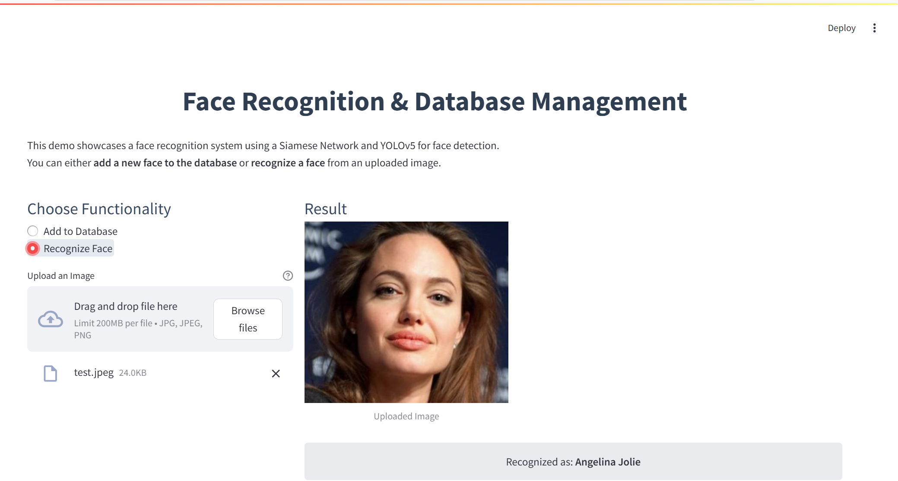

# Face Recognition using Siamese Network & YOLO

## 📌 Overview
This project implements a **face recognition system** using **Siamese Networks** with two different loss functions (**Cosine Loss & Logistic Loss**). It also integrates a **YOLO-based face extractor** to preprocess images before performing recognition.

## 📂 Project Structure
```
├── report/           # Contains the project report and presentation slides
├── src/              # Source code for face extraction & face recognition demo
│   ├── face_extractor/   # YOLO-based face detection & extraction
│   ├── demo/             # Streamlit demo for face recognition
├── data.txt          # Link to the dataset used in training
├── models.txt        # Links to the trained Siamese model & YOLO model
├── requirements.txt  # Required dependencies
├── README.md         # Project documentation (this file)
├── images/           # Contains images for documentation
```

## 🚀 Features
- **Face Recognition** using a **Siamese Network** trained with **Cosine Loss & Logistic Loss**
- **Face Extraction** using a **YOLO-based model**
- **Pretrained models provided** for quick deployment
- **Streamlit-based UI** for easy interaction & testing

## 🖥️ Demo Interface Preview
Below is the demo interface of the **Face Recognition System**, where users can upload an image and get recognition results.



## 🛠 Setup Instructions
### 1️⃣ Install Dependencies
```bash
pip install -r requirements.txt
```

### 2️⃣ Download Data & Models
- Dataset link: Check `data.txt`
- Pretrained models link: Check `models.txt`

### 3️⃣ Run the Demo
```bash
cd src/demo
streamlit run app.py
```

## 📊 Model Details
### ✅ Siamese Network
- **Architecture:** InceptionResNetV1 (Facenet-PyTorch)
- **Loss Functions:** Cosine Loss & Logistic Loss
- **Training Data:** LFW dataset

### ✅ YOLO Face Extractor
- **Model:** YOLOv5
- **Purpose:** Extracts faces from images before recognition
- **Training Data:** Face-Detection-Dataset

## 📜 Report & Slides
For a detailed explanation, refer to the **report/** directory.

## 🤝 Contributors
- **Nguyen Cong Nguyen**  
- **Le Tien Quyet**

## 📧 Contact
For any inquiries, reach out via GitHub Issues or email.

---
**⭐ If you find this project useful, give it a star! ⭐**

